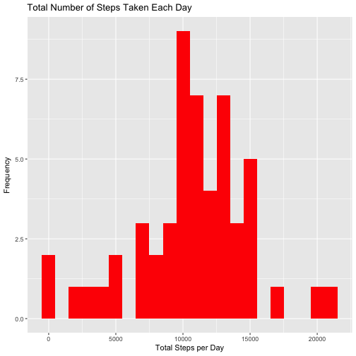
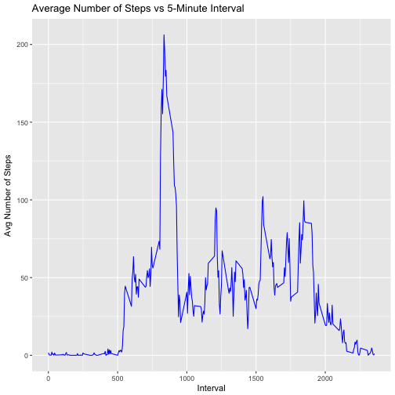
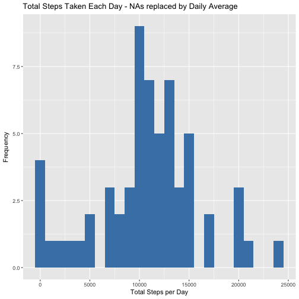
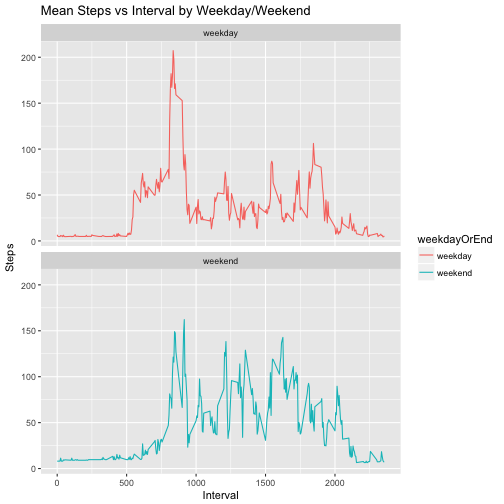

## Introduction

It is now possible to collect a large amount of data about personal movement using activity monitoring devices such as a Fitbit, Nike Fuelband, or Jawbone Up. These type of devices are part of the “quantified self” movement – a group of enthusiasts who take measurements about themselves regularly to improve their health, to find patterns in their behavior, or because they are tech geeks. But these data remain under-utilized both because the raw data are hard to obtain and there is a lack of statistical methods and software for processing and interpreting the data.

This assignment makes use of data from a personal activity monitoring device. This device collects data at 5 minute intervals through out the day. The data consists of two months of data from an anonymous individual collected during the months of October and November, 2012 and include the number of steps taken in 5 minute intervals each day.

The variables included in this dataset are:

  * **steps**: Number of steps taking in a 5-minute interval (missing values are coded as 𝙽𝙰)
  * **date**: The date on which the measurement was taken in YYYY-MM-DD format
  * **interval**: Identifier for the 5-minute interval in which measurement was taken

The dataset is stored in a comma-separated-value (CSV) file and there are a total of 17,568 observations in this dataset.

## Loading and Pre-Processing the Data:

1. Load the data:


```r
if (!file.exists('activity.csv')) {
    unzip('activity.zip')
}
data <- read.csv("activity.csv")
str(data)
```

```
## 'data.frame':	17568 obs. of  3 variables:
##  $ steps   : int  NA NA NA NA NA NA NA NA NA NA ...
##  $ date    : Factor w/ 61 levels "2012-10-01","2012-10-02",..: 1 1 1 1 1 1 1 1 1 1 ...
##  $ interval: int  0 5 10 15 20 25 30 35 40 45 ...
```

```r
head(data)
```

```
##   steps       date interval
## 1    NA 2012-10-01        0
## 2    NA 2012-10-01        5
## 3    NA 2012-10-01       10
## 4    NA 2012-10-01       15
## 5    NA 2012-10-01       20
## 6    NA 2012-10-01       25
```

2. Pre-process the data:


```r
# make a copy of the data frame, which we'll clean
cleanData <- data
# make the 'date' field into a POSIXct Date object:
cleanData$dateTime<- as.POSIXct(cleanData$date, format="%Y-%m-%d")
# remove NA values:
good_idxs <- !is.na(cleanData$steps)
cleanData <- cleanData[good_idxs, ]

str(cleanData)
```

```
## 'data.frame':	15264 obs. of  4 variables:
##  $ steps   : int  0 0 0 0 0 0 0 0 0 0 ...
##  $ date    : Factor w/ 61 levels "2012-10-01","2012-10-02",..: 2 2 2 2 2 2 2 2 2 2 ...
##  $ interval: int  0 5 10 15 20 25 30 35 40 45 ...
##  $ dateTime: POSIXct, format: "2012-10-02" "2012-10-02" ...
```

```r
head(cleanData)
```

```
##     steps       date interval   dateTime
## 289     0 2012-10-02        0 2012-10-02
## 290     0 2012-10-02        5 2012-10-02
## 291     0 2012-10-02       10 2012-10-02
## 292     0 2012-10-02       15 2012-10-02
## 293     0 2012-10-02       20 2012-10-02
## 294     0 2012-10-02       25 2012-10-02
```

## What is the mean number of steps taken per day?

1. Calculate the total number of steps per day:


```r
totalSteps <- aggregate(steps ~ date, cleanData, FUN=sum)
colnames(totalSteps) <- c('date', 'steps')
head(totalSteps)
```

```
##         date steps
## 1 2012-10-02   126
## 2 2012-10-03 11352
## 3 2012-10-04 12116
## 4 2012-10-05 13294
## 5 2012-10-06 15420
## 6 2012-10-07 11015
```

2. Plot a histogram of the total number of steps taken each day.


```r
library(ggplot2)
ggplot(totalSteps, aes(x=steps)) +
        geom_histogram(fill="red", binwidth=1000) +
        labs(title="Total Number of Steps Taken Each Day", x="Total Steps per Day", y="Frequency")
```



3. Calculate and report the mean and median of the total number of steps taken per day:


```r
# Mean number of total steps per day:
meanSteps <- mean(totalSteps$steps)
meanSteps
```

```
## [1] 10766.19
```


```r
# Median number of total steps per day:
medianSteps <- median(totalSteps$steps)
medianSteps
```

```
## [1] 10765
```

_The mean and median of the total number of steps taken per day are 1.0766189 &times; 10<sup>4</sup> and 10765, respectively._

## What is the average daily activity pattern?

1. Make a time series plot (i.e. `type == "1"`) of the 5-minute interval (x-axis) and the average number of steps taken, averaged across all days (y-axis)


```r
# first aggregate mean number of steps by interval:
intervalMeans <- aggregate(steps ~ interval, cleanData, FUN=mean)
colnames(intervalMeans) <- c('interval', 'avgSteps')
head(intervalMeans)
```

```
##   interval  avgSteps
## 1        0 1.7169811
## 2        5 0.3396226
## 3       10 0.1320755
## 4       15 0.1509434
## 5       20 0.0754717
## 6       25 2.0943396
```


```r
# make a time series plot:  
g <- ggplot(intervalMeans, aes(x=interval, y=avgSteps)) 
g + geom_line(color='blue') +
    xlab('Interval') + ylab('Avg Number of Steps') +
    ggtitle('Average Number of Steps vs 5-Minute Interval')
```



2. Which 5-minute interval, on average across all the days in the dataset, contains the maximum number of steps?


```r
# find the index of the largest avg-step value:
idx <- which.max(intervalMeans$avgSteps)
# find the corresponding interval:
intervalMeans$interval[idx]
```

```
## [1] 835
```

## Imputing Missing Values

1. Calculate and report the total number of missing values in the dataset (i.e. the total number of rows with 𝙽𝙰s)


```r
# find number of NAs in step values:
step_NAs <- sum(is.na(data$steps))
step_NAs
```

```
## [1] 2304
```


```r
# sanity check: any NAs in the other variables we 
# need to account for?
any(is.na(data$interval))
```

```
## [1] FALSE
```

```r
any(is.na(data$date))
```

```
## [1] FALSE
```


```r
NA_fraction <- sum(is.na(data$steps))/length(data$steps)
NA_fraction
```

```
## [1] 0.1311475
```

_There are 2304 `NA` values in the data set, accounting for a fraction of 0.1311475 of all observations in the data set._

2. Devise a strategy for filling in all of the missing values in the dataset. The strategy does not need to be sophisticated. For example, you could use the mean/median for that day, or the mean for that 5-minute interval, etc.

_We will replace the missing NA values with the mean number of steps taken for that 5-minute interval (see below for implementation code)._

3. Create a new dataset that is equal to the original dataset but with the missing data filled in.


```r
# make a copy of the original data, which we'll modify
cleanData2 <- data
# create a merged dataset with 'intervalMeans' frame from above
merged <- merge(cleanData2, intervalMeans, by='interval')
# replacee the NAs with the average number of steps for that interval
NA_idxs <- which(is.na(cleanData2$steps))
cleanData2[NA_idxs,'steps'] <- merged[NA_idxs,'avgSteps']
# check that no NAs remain:
any(is.na(cleanData2$steps))
```

```
## [1] FALSE
```

4. Make a histogram of the total number of steps taken each day and Calculate and report the mean and median total number of steps taken per day. Do these values differ from the estimates from the first part of the assignment? What is the impact of imputing missing data on the estimates of the total daily number of steps?


```r
totalSteps2 <- aggregate(steps ~ date, cleanData2, FUN=sum)
colnames(totalSteps2) <- c('date', 'steps')
ggplot(totalSteps2, aes(x=steps)) +
        geom_histogram(fill="steelblue", binwidth=1000) +
        labs(title="Total Steps Taken Each Day - NAs replaced by Daily Average", x="Total Steps per Day", y="Frequency")
```




```r
# Mean number of total steps per day:
meanSteps2 <- mean(totalSteps2$steps)
meanSteps2
```

```
## [1] 10889.8
```

```r
pctChangeMean <- 100*(meanSteps2 - meanSteps)/meanSteps
```


```r
# Median number of total steps per day:
medianSteps2 <- median(totalSteps2$steps)
medianSteps2
```

```
## [1] 11015
```

```r
pctChangeMedian <- 100*(medianSteps2 - medianSteps)/medianSteps
```

_The new mean and median number of steps per day (after replacing NA values) are 1.0889799 &times; 10<sup>4</sup> and 1.1015 &times; 10<sup>4</sup>.  The old mean and median number of steps per day were 1.0766189 &times; 10<sup>4</sup> and 10765._

_Replacing the NA values with the average for the interval changed the mean value by 1.1481368% and the median value by 2.3223409%._

## Are there differences in activity patterns between weekdays and weekends?

1. Create a new factor variable in the dataset with two levels – “weekday” and “weekend” indicating whether a given date is a weekday or weekend day.


```r
# add a 'weekday' factor for clarity / spot checking:
days <- weekdays(as.Date(cleanData2$date))
cleanData2['weekday'] <- days
# add a 'weekdayOrEnd' factor; start by making all of them 'weekday'
cleanData2['weekdayOrEnd'] <- rep('weekday', nrow(cleanData2))
# now change the Saturday/Sunday values to 'weekend'
weekends <- (days == 'Saturday' | days == 'Sunday')
cleanData2$weekdayOrEnd[weekends] <- 'weekend'
```

2. Make a panel plot containing a time series plot (i.e. `type == "1"`) of the 5-minute interval (x-axis) and the average number of steps taken, averaged across all weekday days or weekend days (y-axis). 


```r
# first, aggregate the data by weekday/end, taking the average num steps:
weekdayOrEndMeans <- aggregate(cleanData2$steps ~ cleanData2$interval + cleanData2$weekdayOrEnd, cleanData2, mean)
names(weekdayOrEndMeans) <- c('interval', 'weekdayOrEnd', 'steps')
# Plot:
g <- ggplot(weekdayOrEndMeans, aes(x=interval, y=steps, color=weekdayOrEnd)) + geom_line() + labs(title='Mean Steps vs Interval by Weekday/Weekend', x='Interval', y='Steps') + facet_wrap(~weekdayOrEnd, ncol=1, nrow=2)
plot(g)
```



_The panel plots show similar, but slightly varied shapes for weekends vs weekdays._

